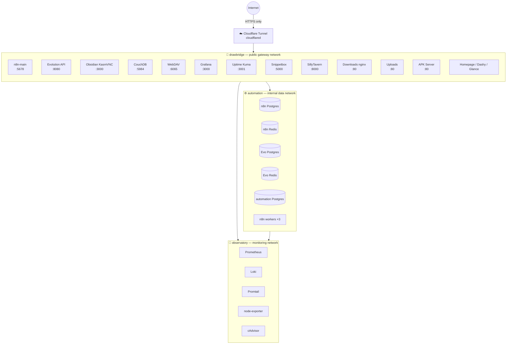

# BoBo Prime — Production Homelab on a Single VPS

> **Self-hosted, security-first, fully observable.** One Contabo VPS. Zero open ports. Every service monitored. Built one phase at a time.

[](https://developers.cloudflare.com/cloudflare-one/connections/connect-networks/)
[](https://n8n.io)
[](https://grafana.com)
[](https://docs.docker.com/compose/)
[](LICENSE)

---

## What you actually get

- **Zero open ports** — Cloudflare Tunnel is the only public door. UFW drops everything else.
- **n8n in queue mode** — main + 3 workers + dedicated Postgres + Redis. Production-grade, not a toy.
- **WhatsApp automation** — Evolution API with full Postgres persistence and Prometheus metrics.
- **Real Obsidian in the browser** — KasmVNC running the genuine desktop app, live-synced to phone + laptop via self-hosted CouchDB.
- **Full observability** — Prometheus, Grafana, Loki, Promtail, node-exporter, cAdvisor, and per-service exporters for every Postgres, Redis, and CouchDB instance.
- **Cloudflare Access gates** — sensitive endpoints (Obsidian, uploads, DB viewer, SillyTavern) require email OTP before they even reach your container.
- **WebDAV bulk storage** — 50 GB archive/downloads/uploads mounted as a network drive on the desktop. None of it ever lands on your laptop.
- **Automated vault-to-GitHub sync** — cron job mirrors Obsidian notes (`.md` only, no secrets, no bloat) to a private GitHub repo twice a week.
- **Everything on three named networks** — clean separation between the data layer, the public gateway, and the monitoring plane.

---

## Architecture



### Shared networks, one clean design

| Network | Purpose | Who joins |
|---|---|---|
| **automation** | Internal data layer. No public traffic ever. | n8n, workers, Evolution API, all Postgres/Redis instances |
| **drawbridge** | Public gateway. Only `cloudflared` bridges to the internet. | Every service that needs a public URL |
| **observatory** | Monitoring plane. Prometheus scrapes everything here. | All containers — nothing is unmonitored |
| **marketing** | Marketing/analytics stack plane. | postiz, listmonk, umami, matomo, metabase, typebot, chatwoot, plausible, posthog |
| **agents** | AI-agent stack plane. | hermes, flowise, langflow, librechat, anythingllm, dify |
| **sites** | Static/site services plane. | obsidian, uploads, downloads, apk-server, tavern |

Each stack also keeps its own private `<app>-internal` network for its datastore.

---

## Service Catalog

### Automation

| Service | Stack | URL | Notes |
|---|---|---|---|
| **n8n** | n8n + Postgres 16 + Redis 7 | `n8n.yourdomain.com` | Queue mode, 3 workers, full Prometheus metrics |
| **Evolution API** | Evolution API + Postgres + Redis | `evolution.yourdomain.com` | WhatsApp HTTP API, WA version pinned |
| **automation-postgres** | Postgres 16 | internal | Bare business-process DB, pgweb viewer for schema work |

### Observability

| Service | Stack | URL | Notes |
|---|---|---|---|
| **Prometheus** | prom/prometheus | internal | 15-day retention, scrapes all exporters |
| **Grafana** | grafana/grafana | `grafana.yourdomain.com` | Provisioned dashboards + Loki datasource |
| **Loki + Promtail** | Grafana Loki 2.9 | internal | All container logs + host cron logs |
| **node-exporter** | prom/node-exporter | internal | Host CPU/RAM/disk/network |
| **cAdvisor** | google/cadvisor | internal | Per-container resource metrics |
| **Uptime Kuma** | louislam/uptime-kuma | `uptime.yourdomain.com` | Service availability monitor |

### Dashboards

| Service | URL | Notes |
|---|---|---|
| **Homepage** | `home.yourdomain.com` | Primary dashboard, Docker socket integration |
| **Dashy** | `dash.yourdomain.com` | Visual bookmark/status board |
| **Glance** | `glance.yourdomain.com` | Feeds, metrics, status at a glance |

### Utility

| Service | Stack | URL | Access Gate | Notes |
|---|---|---|---|---|
| **Obsidian** | linuxserver/obsidian (KasmVNC) | `obsidian.yourdomain.com` | CF Access | Real desktop app in browser, LiveSync'd |
| **CouchDB** | couchdb:3 | `couch.yourdomain.com` | CouchDB auth | LiveSync backend for all Obsidian clients |
| **WebDAV** | hacdias/webdav | `dav.yourdomain.com` | Basic auth | Bulk storage as a mountable network drive |
| **Downloads** | nginx:alpine | `downloads.yourdomain.com` | — | Public read-only file drop |
| **Uploads** | Python 3.12 | `uploads.yourdomain.com` | CF Access | Authenticated file ingestion |
| **APK Server** | nginx:alpine | `apk.yourdomain.com` | — | Self-hosted Android app distribution |
| **Snippetbox** | pawelmalak/snippet-box | `snippets.yourdomain.com` | — | Code/note snippet manager |
| **SillyTavern** | ghcr.io/sillytavern | `tavern.yourdomain.com` | CF Access | AI character interface (OpenRouter backend) |
| **DB Viewer** | sosedoff/pgweb | `db.yourdomain.com` | CF Access | Temporary Postgres UI — bring up on demand |

### Gateway

| Service | Notes |
|---|---|
| **Cloudflare Tunnel** (`cloudflared`) | Single outbound tunnel, 17 ingress rules, handles HTTPS termination, Access gates, and DNS CNAMEs via `deploy-tunnel.sh` |

---

## Repository Layout

```
homelab/
├── automation/         # internal data/automation plane (network: automation)
│   ├── n8n/            #   n8n main + 3 workers + Postgres + Redis
│   ├── evoapi/         #   Evolution API (WhatsApp) + Postgres + Redis
│   ├── postgres/       #   automation-postgres (business-process DB)
│   └── textbee/        #   TextBee SMS gateway (textbee-mongo + Redis)  [vendored]
├── marketing/          # marketing & analytics plane (network: marketing)
│   ├── postiz/         #   social scheduling + Temporal (pg/es exporters)
│   ├── listmonk/  umami/  matomo/  metabase/
│   └── typebot/  chatwoot/  plausible/  posthog/
├── ai-agents/          # LLM agent plane (network: agents)
│   ├── hermes/         #   Open WebUI + homelab-control tool
│   └── flowise/  langflow/  librechat/  anythingllm/  dify/
├── observatory/        # observability plane (network: observatory)
│   ├── docker-compose.yml  # Prometheus + Grafana + Loki + Promtail + exporters
│   ├── dozzle/         #   live container log viewer
│   ├── grafana/        #   gen_dashboards.py + generated dashboards
│   ├── prometheus/     #   scrape config
│   └── uptime-kuma/    #   uptime monitor + provision-monitors.py (status page)
├── dashboards/         # Homepage + Dashy + Glance + beszel/
├── sites/              # static/site services (network: sites)
│   ├── obsidian/  uploads/  downloads/  apk-server/  tavern/
├── ops/                # homelab.sh stack manager + topology docs
├── discussions/        # Q&A write-ups (mirror GitHub Discussions)
├── snippetbox/         # Snippet manager
└── utility/            # cloudflared, couchdb, db-viewer, webdav, claude-code
```

Each leaf folder is an independent `docker-compose.yml`. **Bring stacks up or down individually** with `ops/homelab.sh up|down <dir>` — no cross-stack dependencies beyond the shared Docker networks.

---

## Quick Start

> Full step-by-step: see **[SETUP.md](SETUP.md)**

**Prerequisites:** Docker + Docker Compose v2, a Cloudflare account with a zone, a VPS (1 vCPU / 2 GB RAM minimum — 4 GB recommended for the full stack).

```bash
# 1. Clone
git clone https://github.com/faizanxgp/homelab.git /opt/homelab
cd /opt/homelab

# 2. Create the three shared networks (one-time)
docker network create automation
docker network create drawbridge
docker network create observatory
docker network create marketing
docker network create agents
docker network create sites

# 3. Copy and fill in secrets for the stacks you want
cp automation/n8n/.env.example       automation/n8n/.env
cp automation/evoapi/.env.example    automation/evoapi/.env
cp automation/postgres/.env.example  automation/postgres/.env
cp utility/cloudflared/.env.example  utility/cloudflared/.env
cp utility/couchdb/.env.example      utility/couchdb/.env
cp sites/obsidian/.env.example     sites/obsidian/.env
cp utility/webdav/.env.example       utility/webdav/.env
# edit each .env with your passwords

# 4. Deploy the tunnel (creates tunnel, DNS CNAMEs, Access gates — idempotent)
CF_API_TOKEN=your_token bash utility/cloudflared/deploy-tunnel.sh

# 5. Bring up whatever you want, in any order
docker compose -f observatory/docker-compose.yml    up -d
docker compose -f observatory/uptime-kuma/docker-compose.yml  up -d
docker compose -f utility/cloudflared/docker-compose.yml      up -d
docker compose -f automation/n8n/docker-compose.yml           up -d
docker compose -f automation/evoapi/docker-compose.yml        up -d
docker compose -f utility/couchdb/docker-compose.yml          up -d
docker compose -f sites/obsidian/docker-compose.yml         up -d
# ... add more as needed
```

---

## Design Decisions

**Why Cloudflare Tunnel instead of a reverse proxy?**
No open ports means no attack surface on the VPS itself. UFW drops inbound traffic on every port. The tunnel dials out to Cloudflare; Cloudflare handles TLS, DDoS mitigation, and Access gates. The tradeoff is Cloudflare holds your traffic — acceptable for a personal homelab, wrong for a regulated business.

**Why n8n in queue mode with three workers?**
A single n8n container blocks on long-running executions. Queue mode (Bull + Redis) decouples triggering from executing — the main process handles webhooks, workers pull jobs. Three workers mean three simultaneous heavy workflows don't starve each other. Each worker exposes `/metrics` and `/healthz`.

**Why CouchDB for Obsidian sync instead of just syncing files?**
The Self-hosted LiveSync plugin does bidirectional, conflict-aware sync in real time. CouchDB's replication protocol handles phone + laptop + web vault all writing simultaneously without data loss. A simple rsync or git approach breaks under concurrent edits.

**Why separate Postgres instances for n8n and Evolution API?**
Fault isolation. If the n8n DB gets corrupted or needs a restore, it doesn't affect WhatsApp message history, and vice versa. Schema migrations from n8n or Evolution API upgrades can't accidentally affect the other.

**Why real Obsidian in KasmVNC instead of a web-native notes app?**
The entire Obsidian plugin ecosystem (Dataview, Templater, Tasks, Excalidraw, LiveSync) runs inside the real desktop app. A web-native replacement would lose years of plugin investment. KasmVNC streams the full desktop UI over HTTP — indistinguishable from running it locally.

---

## Secrets Model

`.env` files stay on the server. `.env.example` files (no values) are the only secret-adjacent things in git. The `.gitignore` aggressively excludes:

```
.env  *.env  *.key  *.pem  *.crt  *.token  .cf_api_token  **/secrets/  **/volumes/
```

Never commit a filled-in `.env`. Never add `--no-verify` to bypass the check.

---

## Campaign — Build History

| Phase | What was built |
|---|---|
| **A** | Foundation — Docker, UFW, three networks, base config |
| **B** | Snippetbox — personal snippet manager |
| **C** | Observatory — Prometheus, Grafana, Loki, Uptime Kuma |
| **D** | Data layer — Qdrant vector DB, CouchDB |
| **E** | Automation — n8n (queue mode), Evolution API, TextBee, automation Postgres |
| **F** | Utility — Obsidian web vault, Calibre library |
| **G** | Sites — SillyTavern, custom sites |
| **H** | The Great Lockdown — Cloudflare Tunnel + UFW, zero open ports |
| **I** | Downloads/Uploads file drop, Evolution API QR fix |
| **J** | Obsidian in KasmVNC, CouchDB LiveSync backend, drop inner auth |
| **K** | WebDAV bulk storage drive, vault archive folder |
| **L** | Obsidian vault → GitHub sync, n8n workers ×3, host-job Loki logging |

---

## License

MIT — take it, fork it, run your own.
